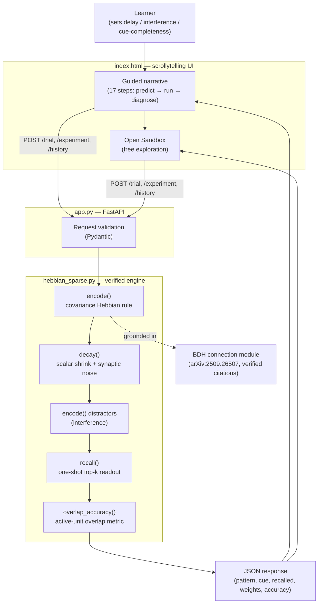

<div align="center">

# 🧠 Hebbian Sandbox

### *"Why does a network remember what just happened — without a memory module?"*

**DataForge 2026 — Pathway Track submission**
*Topic: Synaptic Plasticity as Short-Term Memory*

[](https://hebbian-sandbox.onrender.com)
[](tests/test_regression.py)
[](#license)
[](requirements.txt)

</div>

---

## Overview

Most sequence models treat memory as an explicit, engineered component — a KV-cache, a recurrent buffer, a dedicated memory matrix. **Hebbian Sandbox** is a small, fully verified interactive teaching model that shows memory can emerge for free from a much older and simpler idea: when two neurons fire together, the connection between them temporarily strengthens. That strengthening *is* the memory — no cache, no gate, no separate module. It fades through decay and can be overwritten by interference from competing patterns.

The sandbox connects this mechanism directly to Pathway's **Dragon Hatchling (BDH)** architecture, which relies on the same principle — synaptic plasticity as working memory — verified against the primary paper (arXiv:2509.26507), not secondhand summaries.

> **The one-sentence claim (falsifiable, locked before coding):**
> *A network with no dedicated memory component can still "remember" a recent pattern for several steps, purely because Hebbian updates temporarily strengthen the synapses that just fired together — and that memory decays and can be overwritten by interference, not by an explicit forget gate.*

---

## ✨ Key Features

**Learning Experience**
- 🎓 **17-step guided narrative** — Explore → Experiment → Diagnose → Connect → Sandbox, with paired "What you see / Why it happens" framing at every step
- 🎯 **Predict-before-you-see challenges** — learners hypothesize the effect of interference and delay *before* running the trial, not just watch a demo
- 🔍 **Click-to-diagnose false memories** — identify hallucinated (incorrectly recalled) units directly on the result grid, fully keyboard-navigable (Tab / Enter / Space)
- 🏆 **Threshold-based recovery challenge** — adjust cue completeness to recover a degraded memory to ≥ 80% accuracy
- 🧪 **Open sandbox mode** — all controls unlocked after the guided path, for free experimentation

**Engine & Substrate**
- ⚡ **Real, live computation on every interaction** — nothing precomputed, nothing animated; every trial genuinely encodes, decays, interferes with, and reconstructs a pattern
- 🧬 **Sparse, non-negative activations** (k=10 of n=200 units, ~5% sparsity) matching BDH's own reported activation regime — not an arbitrary choice
- 📊 **Correct evaluation metric** — overlap on true active units, not naive bit-matching (which would misleadingly score a blank output ~95% on patterns this sparse)
- 🔗 **Substantive BDH module** — three claims sourced to exact sections of the Dragon Hatchling paper, an explicit toy-vs-BDH comparison table, and an honest "what's missing" list (scale-free graphs, spiking dynamics, sequence processing, and more)

**Engineering Discipline**
- ✅ **9-test regression suite** protecting the frozen, verified headline numbers (`pytest tests/`)
- 🧮 **Gradient-descent calibration** (`calibrate.py`) — decay/noise parameters optionally re-derived via finite-difference gradient descent against a target memory curve, since the model's discrete top-k step isn't analytically differentiable
- 📜 Full development history disclosed, including **three real bugs found and fixed** during verification (see [Known Limitations](#-known-limitations--development-history))

---

## 🌐 Live Demo & Repository

| | |
|---|---|
| **Live artifact** | [hebbian-sandbox.onrender.com](https://hebbian-sandbox.onrender.com) *(opens without sign-in)* |
| **Source repository** | [github.com/ShamrithaGS/Hebbian_Sandbox](https://github.com/ShamrithaGS/Hebbian_Sandbox) |
| **One-page concept summary** | [`concept_summary.pdf`](concept_summary.pdf) |

> ⚠️ Free-tier hosting on Render sleeps after ~15 minutes of inactivity — the first request after idle may take 30–60s to wake the server. This is disclosed here for transparency, not hidden.

---

## 🏗️ Architecture



### Component roles

| Component | File | Role |
|---|---|---|
| Frontend | `index.html` | Single-file scrollytelling UI — no build step. Renders the synapse heatmap, pattern grids, diff view, and challenge UI from live API responses. |
| Backend | `app.py` | FastAPI service. Validates requests (Pydantic), serves the frontend, and exposes `/trial`, `/experiment`, `/history`, and `/health`. |
| Engine | `hebbian_sparse.py` | The frozen, verified teaching model — see [SHA-256 below](#reproducibility). All memory formation, decay, interference, and recall logic lives here. |
| Calibration | `calibrate.py` | Optional: finite-difference gradient descent to re-derive decay/noise parameters against a target forgetting curve. |
| Tests | `tests/test_regression.py` | 9 tests protecting determinism, headline numbers, and API contracts against regressions. |

**What's live vs. precomputed:** everything is live. Every trial randomly generates a fresh pattern, genuinely encodes it via the Hebbian rule, genuinely decays/interferes with the weight matrix, and genuinely reconstructs it from a partial cue. Nothing is looked up or faked.

---

## 🚀 Getting Started

### Prerequisites
- Python 3.10+
- pip

### Installation

```bash
git clone https://github.com/ShamrithaGS/Hebbian_Sandbox.git
cd Hebbian_Sandbox

python -m venv venv
source venv/bin/activate      # Windows: venv\Scripts\activate

pip install -r requirements.txt
```

### Run locally

```bash
uvicorn app:app --port 8000
```

Open **http://127.0.0.1:8000** in your browser.

### Run the regression suite

```bash
pytest tests/ -v
```

Expected: **9 passed**. These tests protect the frozen headline numbers:
- `delay=0, distractors=0` → exactly `1.0`
- `delay=20, distractors=0` → `≈0.667`
- `delay=20, distractors=20` → `≈0.629`

### Optional: run the gradient-descent calibration

```bash
python calibrate.py
```

---

## 📖 API Reference

| Method | Endpoint | Purpose |
|---|---|---|
| `GET` | `/` | Serves the frontend (`index.html`) |
| `GET` | `/health` | Health check — `{"status": "ok"}` |
| `POST` | `/trial` | Runs one trial with given parameters; returns pattern, cue, recalled output, full weight matrix, and accuracy |
| `POST` | `/experiment` | Runs the averaged sweep across delay steps (used for the decay/interference curve) |
| `POST` | `/history` | Runs one trial and returns a step-by-step snapshot of the weight matrix (subsampled to ≤15 frames) for animated visualization |

**Example `/trial` request:**
```json
{
  "n": 200,
  "sparsity": 0.05,
  "delay": 15,
  "decay_rate": 0.03,
  "noise_std": 0.22,
  "n_distractors": 20,
  "reveal_fraction": 0.4,
  "seed": 10
}
```

---

## 🎓 Who This Is For

**Audience:** data scientists and ML engineers familiar with basic neural network concepts (neurons, weights, activations) but new to brain-inspired short-term memory mechanisms. No prior knowledge of Hebbian learning or BDH required.

**Learning objectives** — after using this sandbox, a learner should be able to:
1. Explain how Hebbian updates can act as short-term memory without a dedicated memory module.
2. Predict how increasing delay or interference will affect recall.
3. Distinguish short-term synaptic memory from durable parameter learning.
4. Describe how BDH uses a related mechanism at model scale, with the same order-of-magnitude sparsity level.

**60-second test:** after one guided trial, a learner should be able to say, in 1–2 sentences, why the network's recall gets worse as delay and interference increase, without prompting.

---

## 🔗 Connection to Dragon Hatchling (BDH)

Primary source: Kosowski, Uznański, Chorowski, Stamirowska, Bartoszkiewicz. *"The Dragon Hatchling: The Missing Link between the Transformer and Models of the Brain."* arXiv:2509.26507 (2025).

| Claim | Section | What it says |
|---|---|---|
| Working memory = Hebbian synapses | Abstract, §1.2 | BDH's working memory during inference relies entirely on synaptic plasticity with Hebbian learning, at a potentiation timescale comparable to minutes of brain activity (~hundreds of tokens) |
| Sparse, non-negative activation | §6.2 | BDH-GPU's positive activation vectors are reported at ~5% sparsity — this sandbox uses exactly that level (k=10 of n=200) |
| Monosemantic synapses | §6.3 | A synapse's in-context state localizes consistently on the same connection across prompts, letting individual synapses be read as concept-specific features |

**Toy model vs. real BDH — what's honestly different:**

| | This toy model | BDH |
|---|---|---|
| Connectivity | Dense 200×200 matrix | Sparse graph, scale-free / heavy-tailed degree distribution |
| Neuron model | Simple binary activation | Spiking neuron dynamics |
| Input | One static pattern array | Continuous sequential token stream |
| Recall mechanism | One-shot dot-product threshold | Formally derived from Transformer attention equations |
| Scale | Fixed, algorithmic, ~40K synapses | Trained GPU-optimized LLM (10M–1B+ parameters) |

**On BDH-CQ:** not directly used here — its focus is test-time task adaptation from demonstrations, whereas this project isolates within-session synaptic memory, interference, and decay. Its relevance to *this specific* concept is not established by this project, and we say so rather than inventing a connection.

This sandbox's toy network is an **independent, simplified reimplementation for teaching purposes — not the official BDH model** — labeled as such throughout the app and this README.

---

## 📚 Primary Research Papers (2022–2026)

1. **Duan, Y., Jia, Z., Li, Q., Zhong, Y., Ma, K.** (2023). *"Hebbian and Gradient-based Plasticity Enables Robust Memory and Rapid Learning in RNNs."* ICLR 2023. [arXiv:2302.03235](https://arxiv.org/abs/2302.03235)
2. **Behrouz, A., Zhong, P., Mirrokni, V.** (2024/2025). *"Titans: Learning to Memorize at Test Time."* Google Research. [arXiv:2501.00663](https://arxiv.org/abs/2501.00663)
3. **Szelogowski, D.** (2025). *"Hebbian Memory-Augmented Recurrent Networks: Engram Neurons in Deep Learning."* [arXiv:2507.21474](https://arxiv.org/abs/2507.21474)
4. **Ellwood, I. T.** (2024). *"Short-term Hebbian learning can implement transformer-like attention."* PLoS Computational Biology, 20(1), e1011843. [doi.org/10.1371/journal.pcbi.1011843](https://doi.org/10.1371/journal.pcbi.1011843)

---

## 🧪 Known Limitations & Development History

This engine went through several rounds of verification, and each round caught a **real bug** that would have quietly invalidated the claim if shipped:

1. **Scalar decay alone is invisible to top-k-based recall** — shrinking every weight by the same factor doesn't change which units score highest, so nothing appeared to forget. Fixed by adding background synaptic noise during decay.
2. **The accuracy metric was wrong for sparse patterns** — with only 5% of units active, "fraction of matching bits" gave a blank, useless output ~95% accuracy. Fixed by measuring overlap only on the true active units.
3. **The cue accidentally revealed the answer** — revealing a fraction of the whole (mostly-zero) vector also revealed the same fraction of the active units for free. Fixed by revealing a fraction of the active units specifically.

**Limitations disclosed directly, not hidden:**
- This is a small, standalone toy model (n=200 units). It is **not** the official BDH implementation.
- Recall is a one-shot readout, not deep recurrent inference — a deliberate choice so decay/interference effects stay honestly visible instead of being masked by iterative cleanup.
- This sandbox's "memory" is entirely within-session. Whether short-term synaptic state could ever consolidate into durable, cross-session learning is an open question — including for BDH itself.

---

## Reproducibility

The frozen, verified engine (`hebbian_sparse.py`) is protected by SHA-256:
```
9a6287877a8f678dcae4eef451c26e74c181b867635f55499c9aff18a4aad4dd
```
Verify locally with `sha256sum hebbian_sparse.py`. Any change to this file should be deliberate and re-verified against `tests/test_regression.py` before merging.

---

## ☁️ Deployment

Deployed on [Render](https://render.com) via:
- `Procfile` — `web: uvicorn app:app --host 0.0.0.0 --port ${PORT:-8000}`
- `render.yaml` — blueprint for automated Render web service deployment (free tier)

To deploy your own instance: connect this repository to Render (or Railway/Heroku, which use the same `Procfile`), and it will build and start automatically.

---

## 👥 Team
**Mohamed Jameen Ali M R**(Lead)  — [@jameen-ali](https://github.com/jameen-ali)

**Shamritha GS**  — [@ShamrithaGS](https://github.com/jameen-ali)

**Pavankumar T**  — [@Pavankumar06T](https://github.com/Pavankumar06T)

**Nishu kumari V**  — [@Nishukumari09](https://github.com/Nishukumari09)

---

## 📄 Credits and Licenses

- **numpy** (BSD-3-Clause), **FastAPI** (MIT), **uvicorn** (BSD-3-Clause) — standard open-source dependencies, unmodified.
- **Fonts:** Fraunces and IBM Plex Mono, loaded from Google Fonts, licensed under the SIL Open Font License.
- All simulation code, the FastAPI backend, and the frontend were written for this project; no external code was copied in.

## License

This project is licensed under the MIT License.

---

## 🤖 AI Assistance Disclosure

This project was built with iterative assistance from AI agents:
- **Implementation:** Antigravity / Gemini 3.6 High (Google DeepMind / Google) proposed initial implementations of the Hebbian memory engine, the FastAPI backend, and the frontend.
- **Independent review / research:** Claude (Anthropic) acted as an independent reviewer and research agent, verifying claims against primary sources and testing behavior end-to-end rather than accepting it on trust.

This process caught and fixed three real bugs (see [Known Limitations](#-known-limitations--development-history) above) and one fabricated citation during drafting, which was removed and replaced with primary sources checked directly against arXiv. **The team is responsible for, and can explain and defend, every claim, citation, and line of code in this submission.**

---

<div align="center">

*Made for DataForge 2026 — Pathway x Rime Track*

</div>
